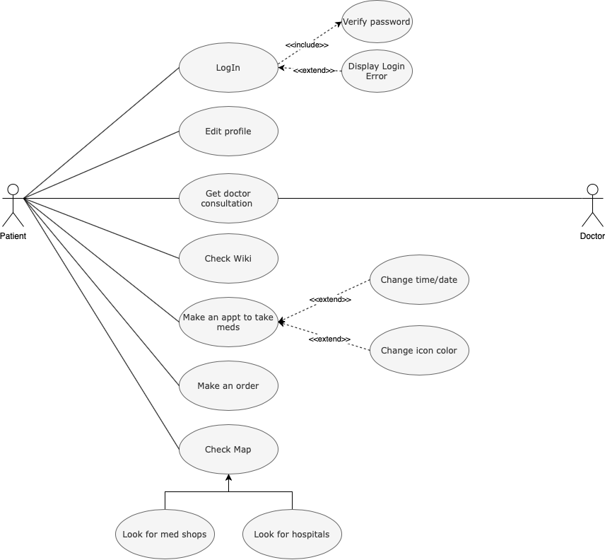

# HealthCare

HealthCare was designed to help people with pills managment. With our easy to use calendar tool user could plan his tablet intake time. With our online store he could order meds from out partner shops for greates price. Map could provie nearest hospitals and meds shops. Wiki provides an oportunity to read about diseases and meds.
# Problem
+ In today's world people frequently forgot about there tablet intake time
+ Often meds shops do not have needed meds
+ People could do not know where are located nearest hospitals and med shops

# Solution
+ A mobile application/web service that notify you about tablet intake time
+ An application where users could buy meds that they need for best price
+ An application that shows users hospital/meds shop location

# Stakeholders
+ Patinent

# Users
+ People who wants to control there tablet intake time

# Use-case Diagram

# Process flow Diagram

# Class Diagram

# Activity Diagram

# Future Scope

# Web-Application Screens

# Mobile-App Screens

# Final Presentation

